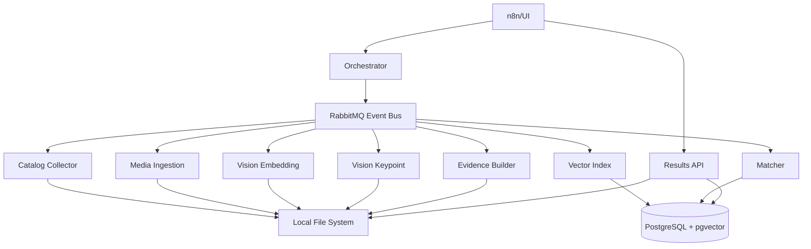
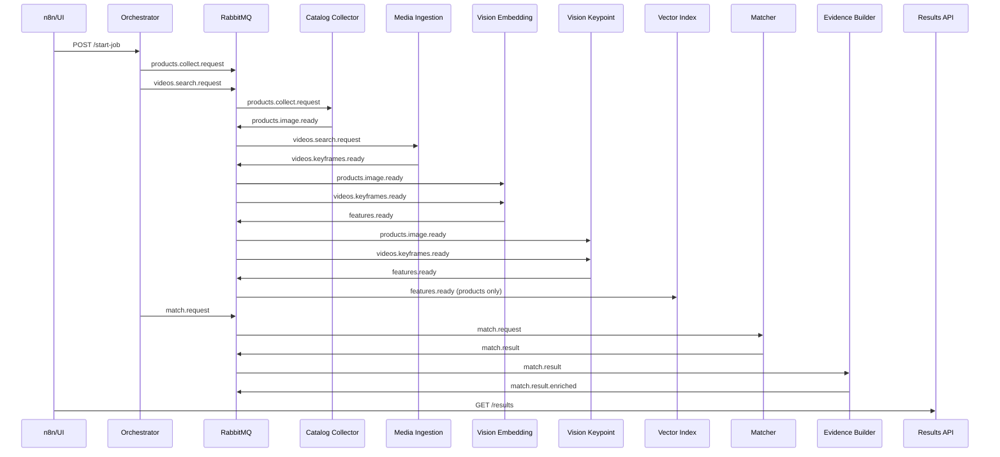

# Design Document

## Overview

The Product-Video Matching system is designed as an event-driven microservices architecture that processes industry keywords to find visual matches between e-commerce products (Amazon/eBay) and video content (YouTube). The system uses an image-first approach with deep learning embeddings and traditional computer vision techniques for high-precision matching.

The architecture follows CQRS principles with separate write-path (event-driven pipeline) and read-path (Results API) to ensure scalability and maintainability.

## Architecture

### High-Level Architecture



### Event Flow Architecture



### Deployment Architecture

The system uses Docker Compose for local development with the following container structure:

- **Infrastructure**: PostgreSQL (with pgvector), RabbitMQ
- **GPU Services**: Vision Embedding (pytorch/pytorch:2.3.0-cuda12.1-cudnn8-runtime)
- **CPU Services**: All other services (python:3.10-slim)
- **Shared Storage**: Local filesystem mounted as volumes

## Components and Interfaces

### 1. Orchestrator Service

**Responsibility**: Job lifecycle management and event coordination

**Key Interfaces**:
- REST API: `POST /start-job`, `GET /status/{job_id}`
- Event Publisher: Initiates collection and matching workflows
- Uses Prefect for workflow orchestration

**Implementation Details**:
- Maintains job state in PostgreSQL
- Publishes initial events and coordinates timing
- Tracks progress across all pipeline stages
- Provides status updates to external systems

### 2. Catalog Collector Service

**Responsibility**: E-commerce product data collection and image processing

**Key Interfaces**:
- Event Consumer: `products.collect.request`
- Event Publisher: `products.image.ready`
- External APIs: Amazon Product API, eBay API

**Implementation Details**:
- Searches products by industry keyword
- Downloads and normalizes product images
- Stores images in `data/products/{product_id}/` structure
- Implements rate limiting and retry logic for API calls
- Generates unique product_id and image_id identifiers

### 3. Media Ingestion Service

**Responsibility**: Video discovery, download, and keyframe extraction

**Key Interfaces**:
- Event Consumer: `videos.search.request`
- Event Publisher: `videos.keyframes.ready`
- External APIs: YouTube Data API

**Implementation Details**:
- Searches YouTube for industry-relevant videos
- Downloads videos using yt-dlp or similar
- Extracts 3-8 keyframes per video using FFmpeg
- Filters out blurry frames using Laplacian variance
- Stores frames in `data/videos/{video_id}/frames/` structure

### 4. Vision Embedding Service (GPU)

**Responsibility**: Deep learning feature extraction from images

**Key Interfaces**:
- Event Consumer: `products.image.ready`, `videos.keyframes.ready`
- Event Publisher: `features.ready`
- ML Models: CLIP ViT-B/32

**Implementation Details**:
- Processes images in batches (32-64) for GPU efficiency
- Generates both RGB and grayscale embeddings
- Normalizes images before processing (resize, center crop)
- Applies grayscale + CLAHE enhancement for robustness
- Falls back to CPU processing if GPU unavailable

### 5. Vision Keypoint Service (CPU)

**Responsibility**: Traditional computer vision feature extraction

**Key Interfaces**:
- Event Consumer: `products.image.ready`, `videos.keyframes.ready`
- Event Publisher: `features.ready`
- CV Algorithms: AKAZE, SIFT

**Implementation Details**:
- Extracts keypoint descriptors using AKAZE (primary) and SIFT (fallback)
- Stores keypoint data as compressed numpy arrays (.npz format)
- Saves keypoint blobs in `data/kp/{entity_id}.npz`
- Handles images with insufficient keypoints gracefully

### 6. Vector Index Service

**Responsibility**: High-performance similarity search using pgvector

**Key Interfaces**:
- Event Consumer: `features.ready` (product images only)
- REST API: `/search` endpoint for ANN queries
- Database: PostgreSQL with pgvector extension

**Implementation Details**:
- Uses HNSW index for approximate nearest neighbor search
- Supports both RGB and grayscale embedding vectors
- Implements cosine similarity for distance metric
- Maintains separate indexes for different embedding types
- Provides configurable top-K retrieval (default: 20)

### 7. Matcher Service

**Responsibility**: Core matching logic combining embeddings and keypoints

**Key Interfaces**:
- Event Consumer: `match.request`
- Event Publisher: `match.result`
- Dependencies: Vector Index Service, local keypoint files

**Implementation Details**:
- **Retrieval Phase**: ANN search using embeddings
- **Rerank Phase**: Keypoint matching with Lowe's ratio test
- **RANSAC**: Geometric verification of keypoint matches
- **Scoring**: Weighted combination of similarity metrics
- **Aggregation**: Product-video level decision making

**Matching Algorithm**:
```
For each product-video pair:
  1. Retrieve top-K similar frames using embeddings
  2. For each candidate pair (product_image, video_frame):
     a. Load keypoint descriptors
     b. Match keypoints using Lowe's ratio (0.7)
     c. Apply RANSAC for geometric verification
     d. Calculate inliers_ratio = inliers / min(kpA, kpB)
     e. Compute pair_score = 0.35*sim_embedding + 0.55*inliers_ratio + 0.10*sim_edge
  3. Aggregate scores: best_score = max(pair_scores)
  4. Count consistency = pairs with score ≥ 0.80
  5. Accept if (best ≥ 0.88 AND consistency ≥ 2) OR best ≥ 0.92
  6. Final score includes bonuses for consistency and coverage
```

### 8. Evidence Builder Service

**Responsibility**: Visual proof generation for matches

**Key Interfaces**:
- Event Consumer: `match.result`
- Event Publisher: `match.result.enriched`
- Output: Evidence images in `data/evidence/`

**Implementation Details**:
- Creates side-by-side comparison images
- Overlays keypoint matches and RANSAC inliers
- Uses different colors for inliers vs outliers
- Includes match score and metadata in image
- Handles cases where keypoint visualization fails

### 9. Results API Service

**Responsibility**: CQRS read-only API for external consumption

**Key Interfaces**:
- REST API: `/results`, `/products/{id}`, `/videos/{id}`, `/matches/{id}`
- Database: PostgreSQL (read-only queries)
- File System: Evidence image serving

**Implementation Details**:
- Implements pagination for large result sets
- Supports filtering by industry, minimum score, date ranges
- Serves static evidence images with proper caching headers
- Provides detailed match metadata including confidence scores
- Uses database indexes for efficient querying

## Data Models

### Database Schema (PostgreSQL + pgvector)

```sql
-- Products table
CREATE TABLE products (
    product_id VARCHAR(255) PRIMARY KEY,
    src VARCHAR(50) NOT NULL, -- 'amazon' or 'ebay'
    asin_or_itemid VARCHAR(255) NOT NULL,
    title TEXT,
    brand VARCHAR(255),
    url TEXT,
    created_at TIMESTAMP DEFAULT CURRENT_TIMESTAMP
);

-- Product images with vector embeddings
CREATE TABLE product_images (
    img_id VARCHAR(255) PRIMARY KEY,
    product_id VARCHAR(255) REFERENCES products(product_id),
    local_path VARCHAR(500) NOT NULL,
    emb_rgb vector(512), -- CLIP embedding dimension
    emb_gray vector(512),
    kp_blob_path VARCHAR(500),
    phash BIGINT, -- Perceptual hash for deduplication
    created_at TIMESTAMP DEFAULT CURRENT_TIMESTAMP
);

-- Videos table
CREATE TABLE videos (
    video_id VARCHAR(255) PRIMARY KEY,
    platform VARCHAR(50) NOT NULL, -- 'youtube', 'bilibili'
    url TEXT NOT NULL,
    title TEXT,
    duration_s INTEGER,
    published_at TIMESTAMP,
    created_at TIMESTAMP DEFAULT CURRENT_TIMESTAMP
);

-- Video frames with vector embeddings
CREATE TABLE video_frames (
    frame_id VARCHAR(255) PRIMARY KEY,
    video_id VARCHAR(255) REFERENCES videos(video_id),
    ts FLOAT NOT NULL, -- Timestamp in video
    local_path VARCHAR(500) NOT NULL,
    emb_rgb vector(512),
    emb_gray vector(512),
    kp_blob_path VARCHAR(500),
    created_at TIMESTAMP DEFAULT CURRENT_TIMESTAMP
);

-- Match results
CREATE TABLE matches (
    match_id VARCHAR(255) PRIMARY KEY,
    job_id VARCHAR(255) NOT NULL,
    product_id VARCHAR(255) REFERENCES products(product_id),
    video_id VARCHAR(255) REFERENCES videos(video_id),
    best_img_id VARCHAR(255) REFERENCES product_images(img_id),
    best_frame_id VARCHAR(255) REFERENCES video_frames(frame_id),
    ts FLOAT, -- Best matching timestamp
    score FLOAT NOT NULL,
    evidence_path VARCHAR(500),
    created_at TIMESTAMP DEFAULT CURRENT_TIMESTAMP
);

-- Indexes for performance
CREATE INDEX idx_product_images_emb_rgb ON product_images USING hnsw (emb_rgb vector_cosine_ops);
CREATE INDEX idx_product_images_emb_gray ON product_images USING hnsw (emb_gray vector_cosine_ops);
CREATE INDEX idx_matches_job_id ON matches(job_id);
CREATE INDEX idx_matches_score ON matches(score);
```

### Event Schemas

Event contracts are defined using JSON Schema and stored in `libs/contracts/`:

```json
{
  "$schema": "http://json-schema.org/draft-07/schema#",
  "title": "ProductsCollectRequest",
  "type": "object",
  "required": ["job_id", "industry", "top_amz", "top_ebay"],
  "properties": {
    "job_id": {"type": "string"},
    "industry": {"type": "string"},
    "top_amz": {"type": "integer", "minimum": 1},
    "top_ebay": {"type": "integer", "minimum": 1}
  }
}
```

### File System Structure

```
data/
├── products/
│   └── {product_id}/
│       ├── {img_id}.jpg
│       └── metadata.json
├── videos/
│   └── {video_id}/
│       ├── frames/
│       │   └── {frame_id}.jpg
│       └── metadata.json
├── kp/
│   └── {entity_id}.npz  # Keypoint descriptors
└── evidence/
    └── {match_id}.jpg   # Match evidence images
```

## Error Handling

### Retry Strategy

- **Exponential Backoff**: Base delay 1s, max delay 60s, max retries 3
- **Retryable Errors**: Network timeouts, temporary API failures, database connection issues
- **Fatal Errors**: Invalid schemas, missing files, authentication failures

### Dead Letter Queues

Each main topic has a corresponding DLQ:
- `products.collect.request.dlq`
- `videos.search.request.dlq`
- `features.ready.dlq`
- `match.request.dlq`

### Idempotency

- **Key Generation**: Hash of relevant fields (URL + timestamp, file path, etc.)
- **Storage**: Redis for short-term idempotency keys
- **Scope**: Per-service idempotency to handle duplicate events

### Logging and Monitoring

- **Structured Logging**: JSON format with correlation IDs
- **Error Codes**: Standardized error classification (RETRY_001, FATAL_002, etc.)
- **Metrics**: Processing times, queue depths, success/failure rates
- **Alerting**: Critical failures, queue backlog, processing delays

## Testing Strategy

### Unit Testing

- **Coverage Target**: >80% for core business logic
- **Focus Areas**: Matching algorithms, image processing, event validation
- **Mocking**: External APIs, file system operations, database calls
- **Tools**: pytest, unittest.mock, pytest-asyncio

### Integration Testing

- **Service Integration**: Test event flow between services
- **Database Integration**: Test with real PostgreSQL + pgvector
- **File System Integration**: Test with mounted volumes
- **Message Queue Integration**: Test with real RabbitMQ

### End-to-End Testing

- **Smoke Tests**: Complete pipeline with sample data
- **Quality Tests**: Precision/recall validation with labeled dataset
- **Failure Tests**: Service failure scenarios and recovery

### Test Data Strategy

- **Sample Products**: Curated set of Amazon/eBay products with known characteristics
- **Sample Videos**: YouTube videos with known product appearances
- **Ground Truth**: Manually labeled matches for quality validation
- **Synthetic Data**: Generated test cases for edge conditions

### Continuous Testing

- **Pre-commit Hooks**: Unit tests and linting
- **CI Pipeline**: Full test suite on every commit
- **Staging Environment**: Integration tests with production-like data
- **Production Monitoring**: Quality metrics and alerting