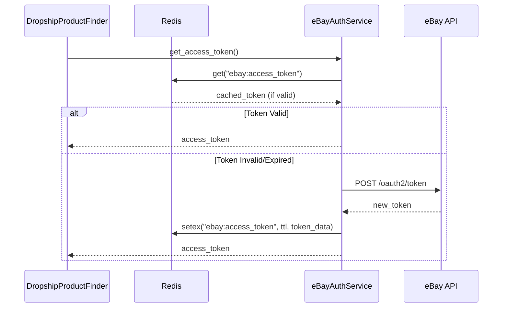

# eBay OAuth 2.0 Integration with Redis

## Overview

This document describes the eBay OAuth 2.0 integration implemented in the dropship-product-finder service, which uses Redis for secure token storage and management.

## Architecture

### Components

1. **eBayAuthService** (`services/auth.py`)
   - Handles OAuth 2.0 client credentials flow
   - Manages token lifecycle (retrieval, storage, refresh)
   - Implements rate limiting and retry mechanisms

2. **Redis Token Storage**
   - Stores access tokens with TTL
   - Provides secure token caching
   - Supports automatic token refresh

3. **EbayProductCollector** (`collectors/collectors.py`)
   - Integrates authentication with eBay API calls
   - Handles token refresh on 401 responses
   - Implements rate limiting

### Flow Diagram



## Configuration

### Environment Variables

```bash
# Redis Configuration
REDIS_URL="redis://localhost:6379/0"

# eBay OAuth Configuration
EBAY_CLIENT_ID="your-client-id"
EBAY_CLIENT_SECRET="your-client-secret"
EBAY_ENVIRONMENT="sandbox"  # or "production"
EBAY_SCOPES="https://api.ebay.com/oauth/api_scope"
```

### Configuration Schema

The configuration is managed through `config_loader.py`:

```python
@dataclass
class DropshipProductFinderConfig:
    # Redis Configuration
    REDIS_URL: str = os.getenv("REDIS_URL", "redis://localhost:6379/0")
    
    # eBay OAuth Configuration
    EBAY_CLIENT_ID: str = os.getenv("EBAY_CLIENT_ID", "")
    EBAY_CLIENT_SECRET: str = os.getenv("EBAY_CLIENT_SECRET", "")
    EBAY_ENVIRONMENT: str = os.getenv("EBAY_ENVIRONMENT", "sandbox")
    EBAY_SCOPES: str = os.getenv("EBAY_SCOPES", "")
    EBAY_TOKEN_URL: str = (
        "https://api.sandbox.ebay.com/identity/v1/oauth2/token"
        if EBAY_ENVIRONMENT == "sandbox"
        else "https://api.ebay.com/identity/v1/oauth2/token"
    )
```

## Token Management

### Redis Key Structure

- **Key**: `ebay:access_token`
- **Value**: JSON string containing token data
- **TTL**: 3300 seconds (55 minutes, 5 minutes before expiration)

### Token Data Format

```json
{
  "access_token": "v^1.1#i^1#p^1...",
  "expires_in": 7200,
  "token_type": "Bearer",
  "stored_at": "2024-01-01T12:00:00Z"
}
```

### Token Refresh Logic

1. **Cache Check**: First checks Redis for valid token
2. **Token Validation**: Validates token expiration (5-minute buffer)
3. **Refresh Trigger**: Automatically refreshes when:
   - Token is expired
   - No cached token exists
   - 401 error received from eBay API

## Security Features

### Token Encryption

- Tokens are stored as JSON strings in Redis
- No additional encryption layer (can be added if required)
- Redis ACLs should be configured for production

### Rate Limiting

- **Minimum Interval**: 1 second between API calls
- **Enforcement**: Automatic sleep when calls are too frequent
- **Configurable**: Can be adjusted via `MIN_API_CALL_INTERVAL`

### Error Handling

- **401 Responses**: Automatic token refresh and retry
- **HTTP Errors**: Graceful degradation with empty results
- **Redis Errors**: Fallback to in-memory token cache

## Implementation Details

### eBayAuthService Methods

```python
class eBayAuthService:
    def __init__(self, config, redis_client):
        # Initialize with configuration and Redis client
    
    async def get_access_token(self) -> str:
        # Returns valid token (cached or new)
    
    async def _refresh_token(self) -> None:
        # Requests new token from eBay
    
    async def _store_token(self, token_data: dict) -> None:
        # Stores token in Redis with TTL
    
    async def _retrieve_token(self) -> dict:
        # Retrieves token from Redis
    
    def _is_token_valid(self, token_data: dict) -> bool:
        # Checks token expiration
    
    async def _enforce_rate_limit(self) -> None:
        # Enforces minimum API call interval
```

### Integration with Service

The authentication service is integrated through the service hierarchy:

1. **main.py**: Creates Redis client
2. **DropshipProductHandler**: Receives Redis client
3. **DropshipProductFinderService**: Passes Redis to collectors
4. **EbayProductCollector**: Uses auth service for API calls

## Testing

### Unit Tests

- **test_auth.py**: Tests eBayAuthService functionality
- **test_collectors.py**: Tests eBay collector integration

### Test Coverage

- Token caching and retrieval
- Token refresh logic
- 401 error handling
- Rate limiting enforcement
- Error scenarios

### Running Tests

```bash
cd services/dropship-product-finder
python -m pytest tests/ -v
```

## Deployment

### Docker Configuration

Ensure Redis is available in your Docker environment:

```yaml
# docker-compose.yml
version: '3.8'
services:
  dropship-product-finder:
    environment:
      - REDIS_URL=redis://redis:6379/0
    depends_on:
      - redis
  
  redis:
    image: redis:alpine
    ports:
      - "6379:6379"
```

### Production Considerations

1. **Redis Security**: Configure ACLs and TLS
2. **Token Security**: Consider encrypting sensitive token data
3. **Monitoring**: Implement Redis and eBay API monitoring
4. **Backup**: Configure Redis persistence for critical data

## Troubleshooting

### Common Issues

1. **Token Not Found**: Check Redis connection and credentials
2. **401 Errors**: Verify client ID/secret and scopes
3. **Rate Limiting**: Monitor API call frequency
4. **Redis Errors**: Check Redis availability and connectivity

### Debug Mode

Enable debug logging for troubleshooting:

```python
import logging
logging.getLogger("services.auth").setLevel(logging.DEBUG)
logging.getLogger("collectors.collectors").setLevel(logging.DEBUG)
```

## Performance

### Optimization

- **Token Caching**: Reduces eBay API calls
- **Rate Limiting**: Prevents API throttling
- **Async Operations**: Non-blocking token management
- **Connection Pooling**: Efficient HTTP client usage

### Metrics

Monitor these key metrics:
- Token cache hit ratio
- Token refresh frequency
- API call latency
- Error rates

## Future Enhancements

1. **Multi-tenant Support**: Separate token storage per tenant
2. **Token Encryption**: Add encryption for sensitive data
3. **Circuit Breaker**: Protect against eBay API failures
4. **Metrics Integration**: Prometheus/Grafana monitoring
5. **Configuration Hot Reload**: Dynamic configuration updates